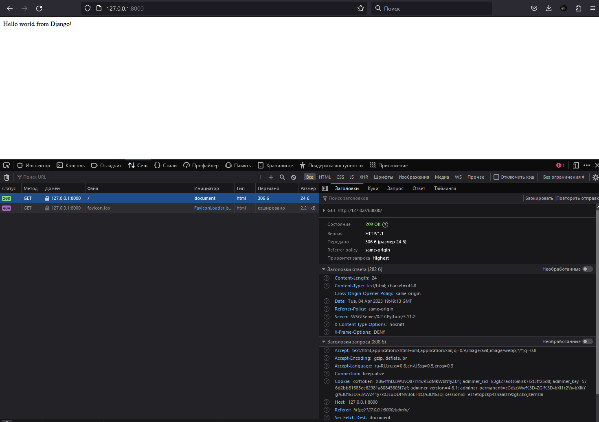

# Проект "DJ DOCKER"

Проект "DJ DOCKER" — это простое Django приложение, которое запускается в контейнерах Docker. В приложении используется база данных PostgreSQL, а также административный интерфейс Adminer для управления базой данных.

## Запуск проекта

Для запуска проекта необходимо установить Docker и Docker Compose на свой компьютер. После этого нужно склонировать репозиторий с проектом:

```bash
git clone https://github.com/AX2048/DJ_DOCKER.git
```

Затем нужно перейти в директорию с проектом и запустить команду:

```bash
docker-compose up
```

После этого контейнеры Docker будут созданы и запущены. Django приложение будет доступно на порту 8000, а Adminer будет доступен на порту 8080. Для остановки контейнеров нужно выполнить команду:

Если запускать проект с 0, то папки с джанго не будет, но после не удачной попытки `docker-compose up` нужно выполнить:

```
docker-compose run web django-admin startproject myproject .
```

Завершить проект:
```
docker-compose down
```

Django: http://127.0.0.1:8000

Adminer: http://127.0.0.1:8080


## Структура проекта

Проект содержит следующие файлы и директории: 
- `README.md` - файл с описанием проекта 
- `Dockerfile` - файл для сборки образа Django приложения 
- `docker-compose.yml` - файл для запуска контейнеров Docker 
- `myapp/` - директория с Django приложением 
- `myapp/settings.py` - файл с настройками Django приложения 
- `requirements.txt` - файл со списком зависимостей Python для Django приложения 
- `myapp/static/` - директория со статическими файлами Django приложения 
- `myapp/templates/` - директория с шаблонами Django приложения 
- `postgres-data/` - директория для хранения данных PostgreSQL

## Изменение настроек

Если нужно изменить настройки Django приложения, то нужно отредактировать файл `myapp/settings.py`. Если нужно добавить новые зависимости Python, то нужно добавить их в файл `myapp/requirements.txt`. После этого необходимо пересобрать Docker образ командой:

```
docker-compose build
```
Если проект запускаля с 0, нужно изменить `settings.py`:
```
import os
...
DATABASES = {
    'default': {
        'ENGINE': 'django.db.backends.postgresql',
        'NAME': 'mydb',
        'USER': 'myuser',
        'PASSWORD': 'mypassword',
        'HOST': 'db',
        'PORT': '5432',
    }
}
...
STATIC_URL = '/static/'
STATIC_ROOT = os.path.join(BASE_DIR, 'static/')
```
Здесь мы добавили модуль `os`, настроили работу с `postgresql`, указали директории со статикой.

После этого можно делать миграцию, создавать суперпользователя и собирать статику.

## Дополнительные команды

Для выполнения миграций базы данных необходимо запустить контейнер в интерактивном режиме и выполнить команду `python manage.py migrate`:

```
docker-compose run --rm web python manage.py makemigrations
docker-compose run --rm web python manage.py migrate
```

Для создания суперпользователя Django необходимо запустить контейнер в интерактивном режиме и выполнить команду `python manage.py createsuperuser`:

```
docker-compose run --rm web python manage.py createsuperuser
```

Для сбора статических файлов Django необходимо запустить контейнер в интерактивном режиме и выполнить команду `python manage.py collectstatic`:

```
docker-compose run --rm web python manage.py collectstatic
```

Посмотреть в pip list:
```
docker-compose run web pip list
```
Сохранение логов в файл:
```
docker-compose logs -f -t >> myDockerCompose.log
```

Проверить версию `postgres`:
```
docker-compose run --rm db postgres -V
```

## Доступы

DJ:
```
	    'USER': 'djadmin',
        'PASSWORD': 'djadmin'
```

ADMINER:
```
        'NAME': 'mydb',
        'USER': 'myuser',
        'PASSWORD': 'mypassword',
        'HOST': 'db',
```

---

## Продолжение

Создадим django приложение `myapp1`:
```
docker-compose run --rm web python manage.py startapp myapp1
```

Добавим приложение в `myapp/myproject/settings.py`:
```
INSTALLED_APPS = [
    'django.contrib.admin',
    'django.contrib.auth',
    'django.contrib.contenttypes',
    'django.contrib.sessions',
    'django.contrib.messages',
    'django.contrib.staticfiles',
    "myapp1",
]
```
Создадим `myapp/templates/index.html`

Далее нужно зарегистрировать путь в `myapp/myproject/settings.py`:
```
TEMPLATES = [
    {
        ...
        "DIRS": ['templates'],
        ...
```

Добавим вид во `myapp/myapp1/views.py`:
```
def index_page(request):
    return render(request, "index.html")
```

Добавим в `myapp/myproject/urls.py`:
```
from django.contrib import admin
from django.urls import path
from myapp1.views import index_page # добавим view из нашего myapp1

urlpatterns = [
    path('admin/', admin.site.urls),
    path("", index_page), # путь к главной страницу ( index )
]
```

Теперь если зайти на http://127.0.0.1:8000/ мы увидем:

